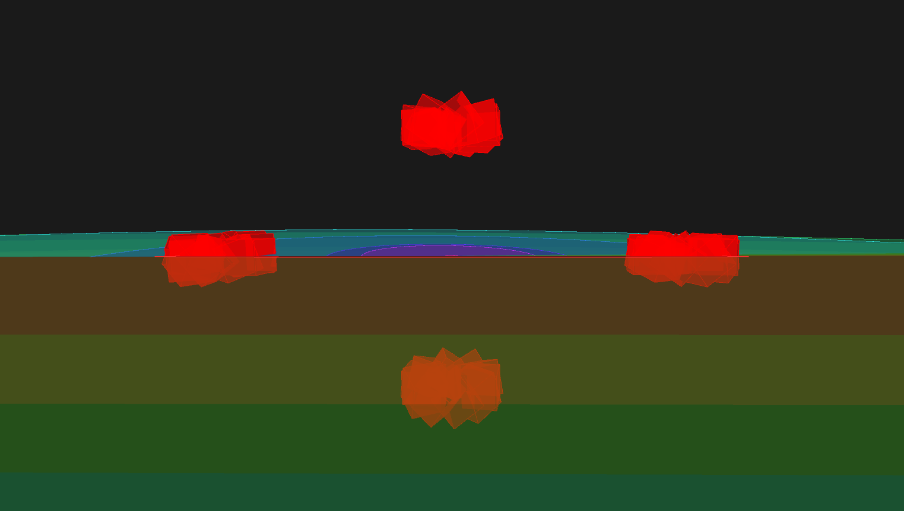
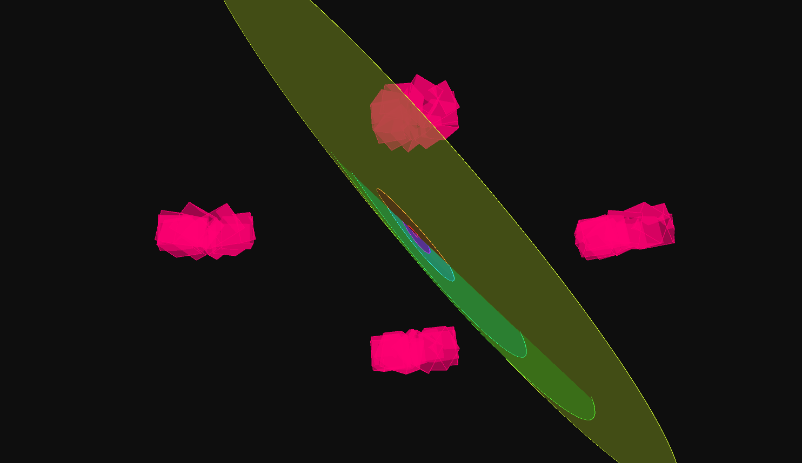
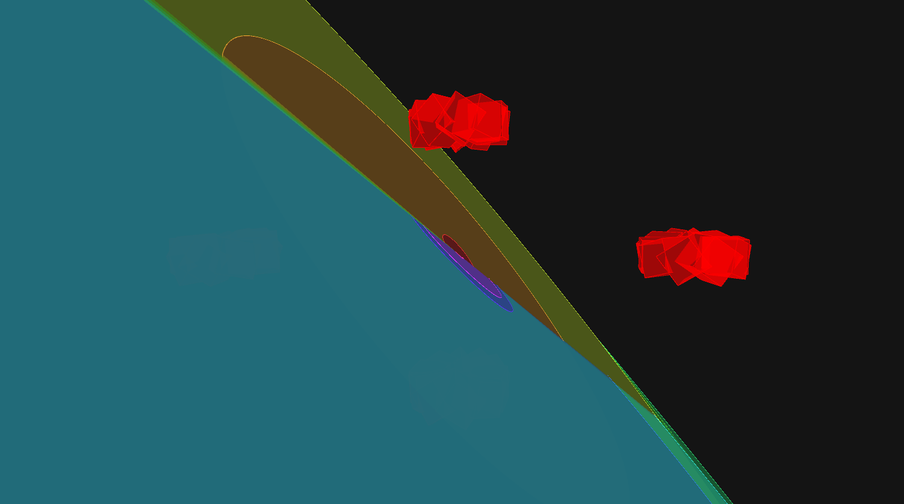
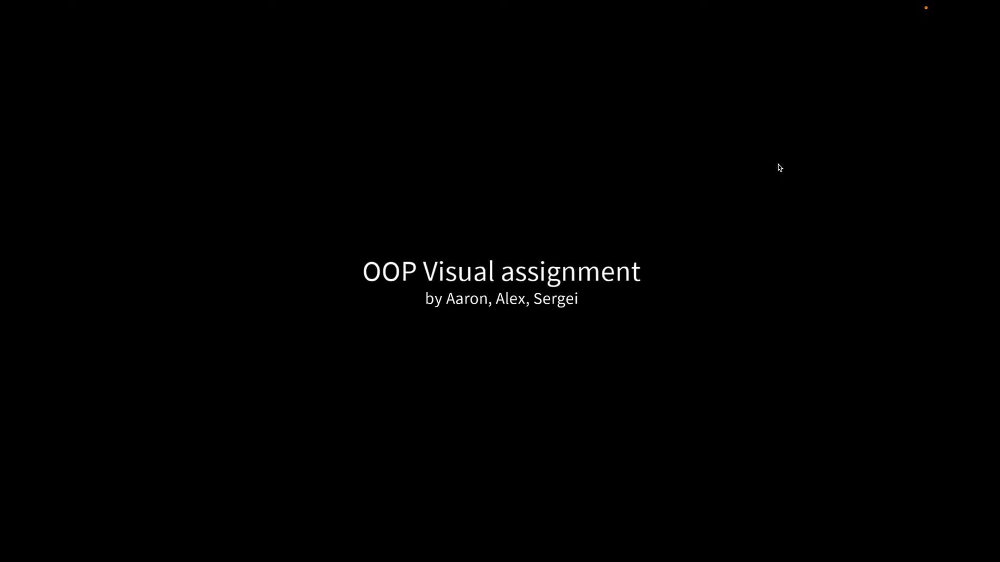

# Music Visualiser Project

| Name | Student Number |
|-----------|-----------|
| Alex Mackey | C22739165 |
| Sergei Larionov | C22483302 |
| Aaron Connolly | C22410766 |


# Description of the assignment
This is our visualization of Bohemian Rhapsody by Queen. We felt that this song chnages drastcially minute to minute so
therefore it would be the best choice to do a visualization project on. Due to all of the chnages we would be able to showcase
everything that we learnt as the song transitioned between different beats, moods and speeds etc.

# Instructions
Our song changes at specific intervals that we chose below.

| TimeStamp | Visual | Mode |
|-----------|-----------|-----------|
| 0:00 - 0:16 |Intro | 4 |
| 0:16 - 1:57 | Alex | 0 |
| 1:57 - 3:04 | Sergei | 3 |
| 3:04 - 4:09 | Sergei | 2 |
| 4:09 - 5:59 | Aaron | 1 |

Apart from that you can use "p" to pause the audion and you can use the number keys above to manually chnage between the visualizations.

### How it works
# Alex
My code used the OOP principles of encapsulation and inheritance. The majority of the code is the "BoxClass" and "RotatingCircles" classes. These are then called on in "Alex" class which is my visulation. It comprises of 4 boxsets from the Boxclass class, that rotate at different speeds and change colours based on amplitude and frquency bands. These box sets have a set position within the visual. The RotatingCircles class draws several circles that each correspond to a different frequency band. The size of the circles and the colours are mapped based on the frquency bands. The circles then swirl around somewhat passively but this leads to some very cool effects at time. The "Alex" class calls on the circle and box classes and visualises them on the screen. It also calculated the Fast Fourier Transform which calculates all the different frequency bands.







# Sergei


# Aaron


# What we are most proud of in the assignment
We are most proud of using everything we learned this year to create a music visualization that uses OOP principles, primarily encapsulation and inheritance. We are proud of how the visual turned out and the way that the visualization came together. We like how the visuals start of quite tame and calm just like the song does. Then when the tempo and beat get more dramatic so do the visuals which is only fitting for a song like "Bohemian Rhapsody". 

# Please see our youtube video below
[](https://www.youtube.com/watch?v=2o4Mb21h-a0&list=WL&index=77)


# Markdown Tutorial

This is *emphasis*

This is a bulleted list

- Item
- Item

This is a numbered list

1. Item
1. Item

This is a [hyperlink](http://bryanduggan.org)

# Headings
## Headings
#### Headings
##### Headings

This is code:

```Java
public void render()
{
	ui.noFill();
	ui.stroke(255);
	ui.rect(x, y, width, height);
	ui.textAlign(PApplet.CENTER, PApplet.CENTER);
	ui.text(text, x + width * 0.5f, y + height * 0.5f);
}
```

So is this without specifying the language:

```
public void render()
{
	ui.noFill();
	ui.stroke(255);
	ui.rect(x, y, width, height);
	ui.textAlign(PApplet.CENTER, PApplet.CENTER);
	ui.text(text, x + width * 0.5f, y + height * 0.5f);
}
```

This is an image using a relative URL:


This is an image using an absolute URL:


This is a youtube video:

[](https://www.youtube.com/watch?v=J2kHSSFA4NU)

This is a table:

| Heading 1 | Heading 2 |
|-----------|-----------|
|Some stuff | Some more stuff in this column |
|Some stuff | Some more stuff in this column |
|Some stuff | Some more stuff in this column |
|Some stuff | Some more stuff in this column |

