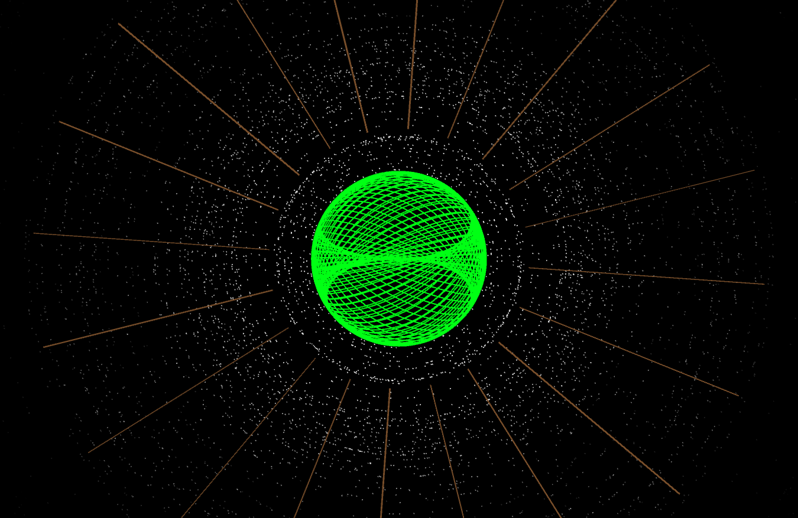

# Music Visualiser Project

| Name | Student Number |
|-----------|-----------|
| Alex Mackey | C22739165 |
| Sergei Larionov | C22483302 |
| Aaron Connolly | C22410766 |

# Description of the assignment
This is our visualization of Bohemian Rhapsody by Queen. We felt that this song chnages drastcially minute to minute so
therefore it would be the best choice to do a visualization project on. Due to all of the chnanges we would be able to showcase
everything that we learnt as the song transitioned between different beats, moods and speeds etc.

# Instructions
Our song changes at specific intervals that we chose below.

| TimeStamp | Visual | Mode |
|-----------|-----------|-----------|
| 0:00 - 0:16 |Intro | 4 |
| 0:16 - 1:57 | Alex | 0 |
| 1:57 - 3:04 | Sergei | 3 |
| 3:04 - 4:09 | Sergei | 2 |
| 4:09 - 5:59 | Aaron | 1 |

Apart from that you can use "p" to pause the audio and you can use the number keys above to manually change between the visualizations.

### How it works
# Alex
My code used the OOP principles of encapsulation and inheritance. The majority of the code is the "BoxClass" and "RotatingCircles" classes. These are then called on in "Alex" class which is my visulation. It comprises of 4 boxsets from the Boxclass class, that rotate at different speeds and change colours based on amplitude and frquency bands. These box sets have a set position within the visual. The RotatingCircles class draws several circles that each correspond to a different frequency band. The size of the circles and the colours are mapped based on the frquency bands. The circles then swirl around somewhat passively but this leads to some very cool effects at time. The "Alex" class calls on the circle and box classes and visualises them on the screen. It also calculated the Fast Fourier Transform which calculates all the different frequency bands.

# Sergei
The first visual consists of multiple shapes, boxes, spheres and cylinders which spin and orbit at differnet speeds based on the amplitude, each shape has their own segment using the frequency bands which allows them to change differently based on the frequency which gives it an orchestra feeling which matches the part of the song it plays during. The colors are also based on the amplitude giving it an rgb effect. The shapes are placed using translate and an increment in the angle to give it a eplise shape.

The second visual consists of a spinning pyramid with a floating eye above and a wavy landscape beneath. The outer eye is created using an elipse and the pupil has a pulsing effect which is from using the map feature and the amplitude. It also follows the mouse cursor by mapping the coordinates of the cursor and adjusting the eye size. The pyramids rotation and visual dynamics are achieved through continuous updates to the vertex positions (angle1, angle2, angle3) based on the amplitude. The wavy landscape is generated using the noise and map feature to create dynamic wave patterns across horizontal sections of the screen. Each wave's height is influenced by the audio amplitude giving it a wavy/hilly look. The color of the landscape is also based on the amplitude leaving it red at its quietist moments and blue during the loudest moments.

# Aaron
My goal for my visual was to create something that could match both the intense start and subtle end to my segemnt of the song.
My Visual consist of multiple elipses rotating on the X and Y axis that forms a sphere like shape. The speed of rotation, radiusn of the elipse and colour are all affected by amplitude. 
I also included a particle affect that fires hundres of particles from the perimeter of the sphere outwards that slowly fade and despawn. The particles velocity and spawn rate is affected by amplitude. If the amplitude is low enough, the particles fire inwards instead of outwards to create a cool effect. I created a seperate class for particles, but also have code for them in AaronVisual inside the particle function.
I allocated 9 seperate sets of lines to the 9 frequency bands declared in Visual that will appear for a minimum of one second if the corresponding frequency band is the highest at that moment. I also added beat detection code to trigger the lines code. each set of lines has seperate length, colour and location. They also have a strobe effect which make sthem flicker. This variety creates a very appealing effect.

Towards the end of my segment, the music gets quieter, which slows down the rotation of the elipses and the particles fire inwards. This creates what looks like an eye ball blinking which I thought was a very cool aspect. With this I achieved my goal of having a cool subtle ending to the song after the intensity beforehand.

I also created the opening screen which has our names pulsing big to small.

# What we are most proud of in the assignment
We are most proud of using everything we learned this year to create a music visualization that uses OOP principles, primarily encapsulation and inheritance. We are proud of how the visual turned out and the way that the visualization came together. We like how the visuals start of quite tame and calm just like the song does. Then when the tempo and beat get more dramatic so do the visuals which is only fitting for a song like "Bohemian Rhapsody". 

# Please see our youtube video below

